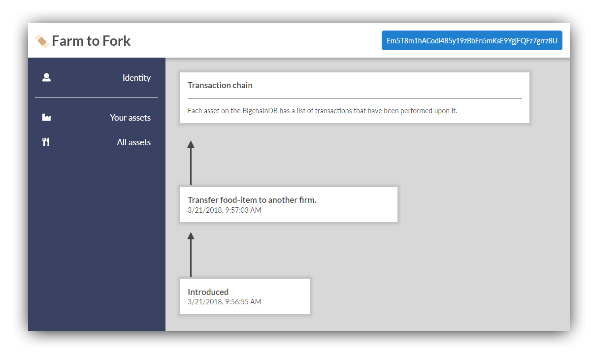

# Farm to Fork

Farm to fork blockchain proof of concept using BigchainDB based on the [tutorial](https://medium.com/wearetheledger/bigchaindb-a-hands-on-approach-42e1d3b4e7a) by Artus Vranken. From the original repo:

After cloning down the repo, the app may be run with `http-server`.

## A Proof-of-concept with the help of BigchainDB.

This POC was created as a follow-along project for this tutorial.

To gain a better understanding, follow [the tutorial on medium](https://medium.com/wearetheledger/bigchaindb-a-hands-on-approach-42e1d3b4e7a)!

